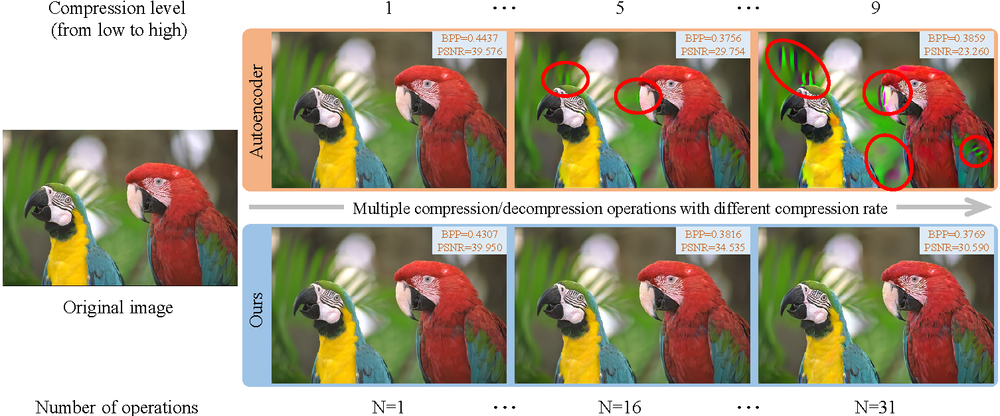

# High-Fidelity Variable-Rate Image Compression via Invertible Activation Transformation
 

## Installation

We tested our code in Ubuntu 18.04.5 LTS, g++ 7.5.0, cuda 11.1, python 3.8.11, pytorch 1.8.2.

Install needed packages.
- `$ pip install torch==1.8.2+cu111 torchvision==0.9.2+cu111 torchaudio==0.8.2 -f https://download.pytorch.org/whl/lts/1.8/torch_lts.html`
- `$ pip install -r requirements.txt`
- `$ pip install compressai==1.1.8`

## Dataset
- Training set: [Flicker 2W](https://www.flickr.com/photos/) about 20745 images or [here](https://github.com/liujiaheng/CompressionData). Run the data preprocessing file ./scripts/flicker_process.py
- Test set: [Kodak dataset](http://r0k.us/graphics/kodak/), [CLIC](http://clic.compression.cc/2021/tasks/index.html), [DIV2K](https://data.vision.ee.ethz.ch/cvl/DIV2K/)

Run following command in `scripts` directory  to create your_trainset.csv and your_testset.csv.

- `$ python get_paths.py --dir=your_train_dataset_dir/ --name=your_trainset`
- `$ python get_paths.py --dir=your_test_dataset_dir/ --name=your_testset`
- `your_trainset.csv` and `your_testset.csv` will be created in `data` directory.

## Training
### Configuration
We used the configuration as `./configs/config.yaml` to train our model.

### Train
`$ python train.py --config=./configs/config.yaml --name=your_instance_name` \
The checkpoints of the model will be saved in `./results/your_instance_name/snapshots`. \
Training for 2.5M iterations will take about 3 weeks on a single GPU like NVIDIA RTX3090.
At least 12GB GPU memory is needed for the default training setting.

## Evaluation
`$ python eval.py --snapshot=./results/your_instance_name/snapshots/best.pt --testset=./data/your_testset.csv`
We release the [pretrained model](https://pan.baidu.com/s/1oQAEpTiYiz07wzpNB4PQJQ). The extracted password is: `HFVR`. You can download and put it in `results` directory.

Note that as mentioned in original [CompressAI](https://github.com/InterDigitalInc/CompressAI), "Inference on GPU is not recommended for the autoregressive models (the entropy coder is run sequentially on CPU)." So for inference of our model, please run on CPU.

## Citation
If you find this work useful for your research, please cite:
'''
@inproceedings{cai2022high,
  title={High-Fidelity Variable-Rate Image Compression via Invertible Activation Transformation},
  author={Cai, Shilv and Zhang, Zhijun and Chen, Liqun and Yan, Luxin and Zhong, Sheng and Zou, Xu},
  booktitle={Proceedings of the 30th ACM International Conference on Multimedia},
  pages={2021--2031},
  year={2022}
}
'''
